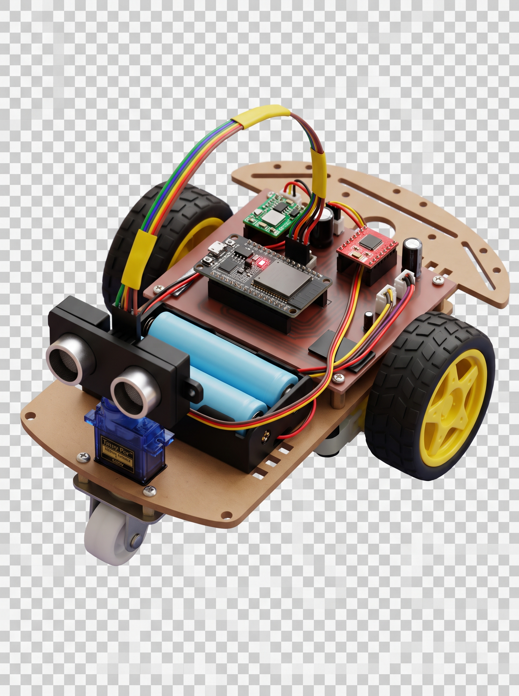
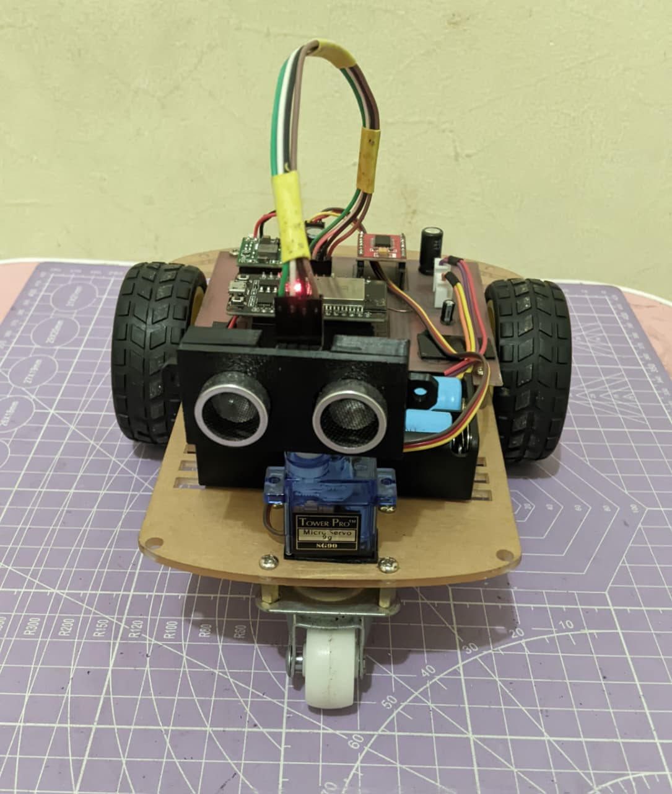
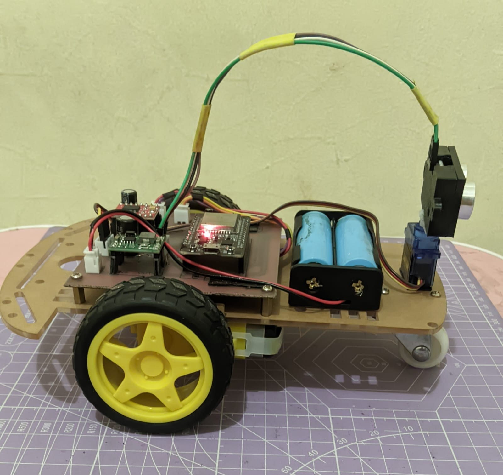
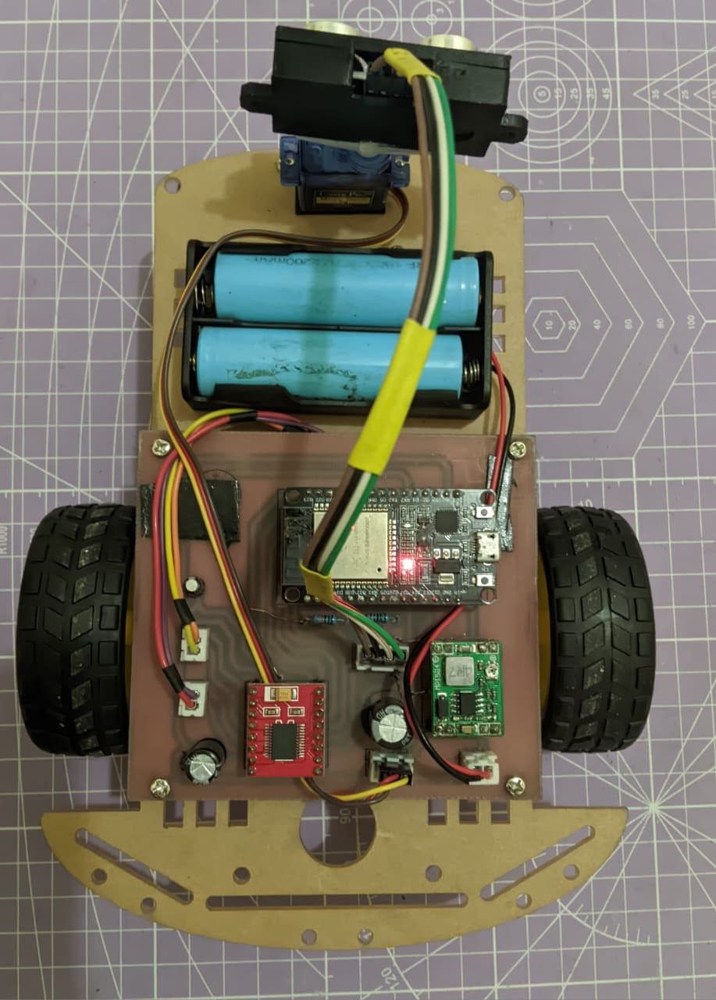
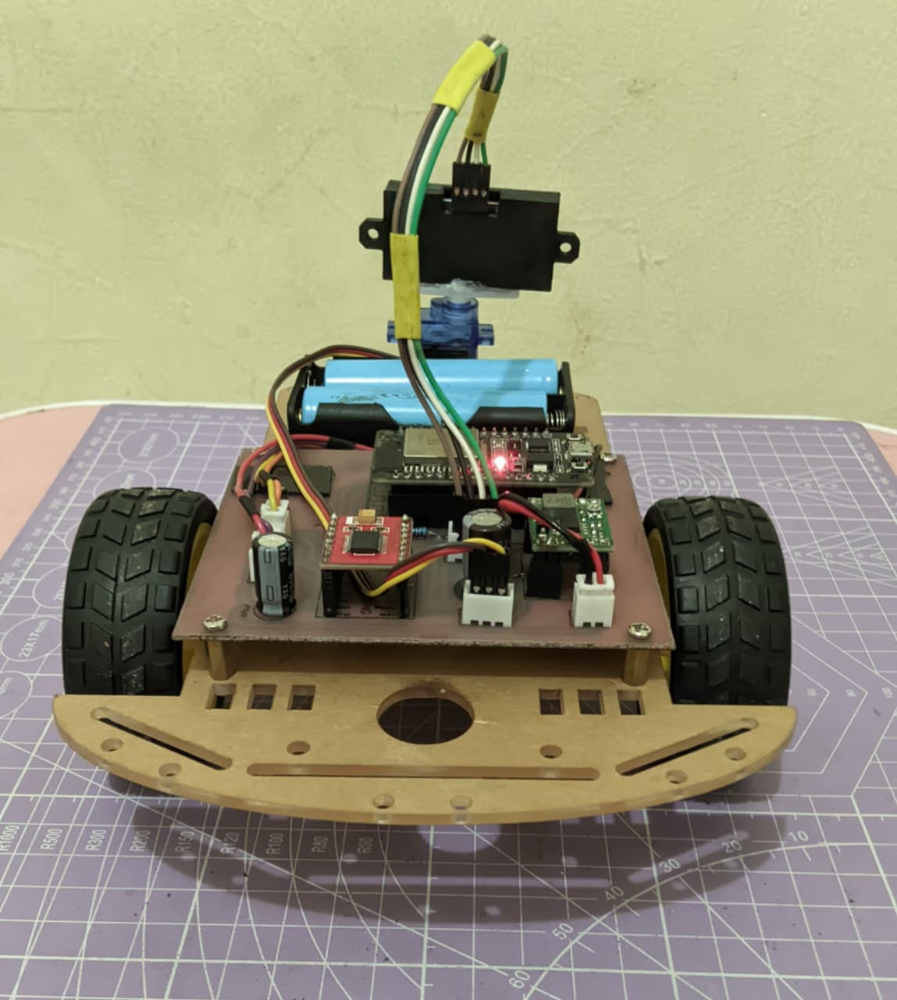
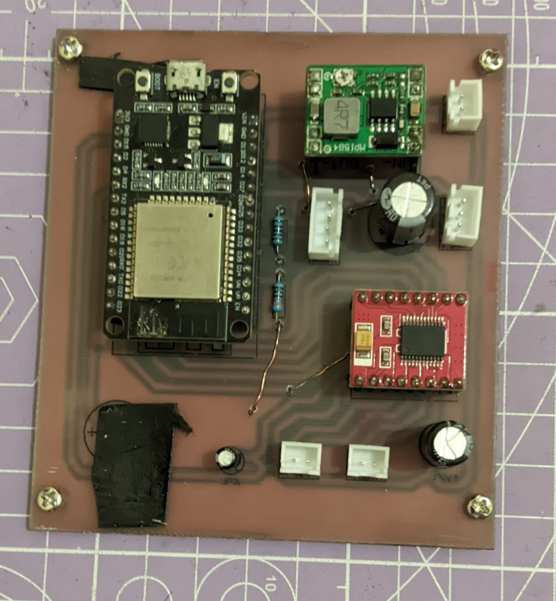
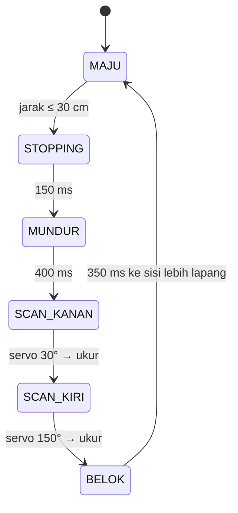
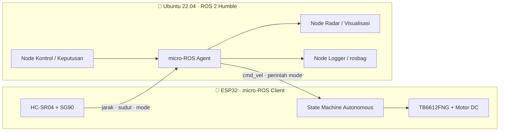

<div align="center">

# 🤖 ROBOT ESP32 AVOIDER

### Dual Mode · Web Dashboard · ROS 2 Humble · micro-ROS

*Robot penghindar halangan berbasis ESP32 untuk pembelajaran robotika, sistem embedded, dan integrasi ROS 2.*

<br>


<br>
<p align="center">
  
</p>
</div>

---

## 🚀 Tentang Proyek

**Robot ESP32 Avoider** memakai sensor ultrasonik **HC-SR04** yang dipasang di atas servo **SG90** sebagai radar mini. Dua motor DC digerakkan lewat driver **TB6612FNG**. Robot dikendalikan dari dashboard web bertema HUD yang dilayani langsung oleh ESP32, dengan dua mode:

| 🕹️ Manual | 🧠 Autonomous |
|---|---|
| Kendali lewat joystick virtual di browser atau aplikasi Android | Robot menghindar halangan sendiri dengan *state machine* hasil kalibrasi |

Selanjutnya robot akan diintegrasikan dengan **ROS 2 Humble** di **Ubuntu 22.04** lewat **micro-ROS**. Data servo, ultrasonik, dan lainnya dikirim ke ROS 2, lalu ROS 2 mengirim data pergerakan balik ke ESP32 untuk dijalankan secara autonomous.

---

## ✨ Fitur Unggulan

| | |
|---|---|
| 🔀 **Dual Mode** | Pindah Manual ↔ Autonomous dengan satu tombol di pojok kiri atas |
| 📡 **ESP32 Access Point** | Terhubung langsung ke robot tanpa router |
| 🎛️ **Dashboard HUD** | Joystick, gauge servo, radar sonar, terminal log, indikator latensi |
| 🛰️ **Radar Sonar** | Visualisasi jarak sesuai sudut sapuan servo |
| ⚙️ **State Machine Non-blocking** | Web server tetap responsif saat robot berjalan otomatis |
| 🛡️ **Failsafe** | Motor berhenti otomatis jika perintah manual terputus 700 ms |
| 🔧 **Core 2.x & 3.x** | Kompatibel dengan Arduino-ESP32 versi lama dan baru |
| 🐧 **ROS 2 Ready** | Dirancang untuk integrasi micro-ROS di Ubuntu 22.04 |

---

## 📸 Galeri Robot

<div align="center">

| Depan | Samping |
|:---:|:---:|
|  |  |

| Atas | Belakang |
|:---:|:---:|
|  |  |

</div>

---

## 🔌 Rangkaian

### 📐 Skematik & 🧵 Wiring Diagram

<div align="center">

</div>

### 🟩 Foto PCB

<div align="center">

| PCB Tampak Atas | PCB Tampak Bawah |
|:---:|:---:|
|  |  |

</div>

### 📍 Konfigurasi Pin

| Fungsi | GPIO | | Fungsi | GPIO |
|---|:---:|---|---|:---:|
| Servo SG90 (signal) | `13` | | Motor B (kanan) PWMB | `14` |
| HC-SR04 TRIG | `33` | | Motor B BIN1 / BIN2 | `26` / `25` |
| HC-SR04 ECHO | `34` | | Motor A (kiri) PWMA | `18` |
| TB6612FNG STBY | `27` | | Motor A AIN1 / AIN2 | `23` / `19` |

> ⚠️ Pin ECHO HC-SR04 mengeluarkan sinyal 5 V, sedangkan GPIO ESP32 hanya toleran 3,3 V. Gunakan pembagi tegangan atau *level shifter* pada jalur Echo.

---

## 🕹️ Firmware Dual Mode

📄 [`firmware/ESP32_AVOIDER/ESP32_AVOIDER.ino`](firmware/ESP32_AVOIDER/ESP32_AVOIDER.ino)

### ⚡ Mulai Cepat

1. Pasang **Arduino IDE** dan paket board **esp32 by Espressif**.
2. Pasang library **ESP32Servo** lewat *Library Manager*.
3. Pilih board **ESP32 Dev Module**, lalu upload sketch.
4. Sambungkan HP atau laptop ke WiFi robot:

   | 📶 SSID | 🔑 Password | 🌐 Alamat |
   |:---:|:---:|:---:|
   | `ESP32-Robot` | `12345678` | `http://192.168.4.1` |

5. Gunakan joystick untuk mode **Manual**, atau tekan tombol **AUTONOMOUS** di pojok kiri atas untuk mode otomatis.

> Dashboard memakai Google Fonts. Tanpa internet, font akan memakai cadangan sistem. Fungsi dan tata letak tidak berubah.

### 🧠 Algoritma Autonomous



| Parameter hasil kalibrasi | Nilai |
|---|:---:|
| Jarak halangan | **30 cm** |
| Kecepatan maju / mundur / belok | **150 / 120 / 100** |
| Waktu mundur / belok | **400 ms / 350 ms** |
| Waktu tunggu servo | **300 ms** |
| Sudut depan / kanan / kiri | **90° / 30° / 150°** |
| Timeout sensor | **15 ms** (tanpa echo = 400 cm) |

> Saat mode Autonomous aktif, joystick, preset servo, dan slider throttle di web dinonaktifkan.

### 🌐 API HTTP

| Endpoint | Fungsi |
|---|---|
| `GET /` | Halaman dashboard |
| `GET /move?dir=F\|B\|L\|R\|S` | Perintah gerak (mode manual) |
| `GET /speed?v=80..255` | Kecepatan manual |
| `GET /servo?angle=0..180` | Sudut servo (mode manual) |
| `GET /mode?m=1` &nbsp;/&nbsp; `?m=0` | `1` = Autonomous, `0` = Manual |
| `GET /status` | Data jarak, mode, sudut servo, kecepatan, channel WiFi, dan state |

<details>
<summary>📦 Contoh respons <code>/status</code></summary>

```json
{"d":42.5,"m":"S","s":90,"p":200,"ch":1,"sta":1,"a":1,"st":0}
```

</details>

📄 Versi autonomous murni tanpa web (acuan kalibrasi): [`firmware/robot_avoider_auto/robot_avoider_auto.ino`](firmware/robot_avoider_auto/robot_avoider_auto.ino)

---

## 🖥️ Tampilan Web Server

<div align="center">

| 🕹️ Mode Manual | 🧠 Mode Autonomous |
|:---:|:---:|
|  |  |

| 📱 Aplikasi Android (APK) |
|:---:|
|  |

</div>

**Panel pada dashboard:**

- 🎚️ **SERVO SG90**: gauge sudut dan preset 0°–180°
- 💻 **COM.TERMINAL**: log perintah dan data sensor
- 📡 **SONAR HC-SR04**: radar setengah lingkaran dengan jarak dalam cm
- 🎮 **CONTROL OVERRIDE**: joystick, status arah, dan throttle
- 📶 **Status koneksi**: ONLINE / OFFLINE dan latensi dalam ms

---

## 🧠 Integrasi ROS 2 Humble + micro-ROS

> 🚧 **Status: dalam perencanaan.** Kode ROS 2 dan micro-ROS belum dibuat. Bagian ini memuat rancangan dan akan diperbarui setelah implementasi dan pengujian.

### 🎯 Tujuan

- 📤 **ESP32 → ROS 2**: sudut servo, jarak ultrasonik, mode, dan data lain yang sama dengan di web server dipublikasikan sebagai *topic* ROS 2.
- 📥 **ROS 2 → ESP32**: ROS 2 mengirim data pergerakan melalui micro-ROS, dan ESP32 menjalankannya secara **autonomous**.

### 🏗️ Arsitektur



### 📡 Rancangan Topic *(usulan, bisa berubah)*

| Topic | Tipe pesan | Arah | Isi |
|---|---|:---:|---|
| `/avoider/range` | `sensor_msgs/msg/Range` | ESP32 ➜ ROS 2 | Jarak ultrasonik |
| `/avoider/servo_angle` | `std_msgs/msg/Int16` | ESP32 ➜ ROS 2 | Sudut servo |
| `/avoider/mode` | `std_msgs/msg/String` | ESP32 ➜ ROS 2 | Mode dan state robot |
| `/avoider/cmd_vel` | `geometry_msgs/msg/Twist` | ROS 2 ➜ ESP32 | Data pergerakan |
| `/avoider/mode_cmd` | `std_msgs/msg/String` | ROS 2 ➜ ESP32 | Perintah ganti mode |

<details>
<summary>⌨️ Contoh perintah yang akan dipakai (diverifikasi saat implementasi)</summary>

```bash
# Jalankan micro-ROS Agent (transport UDP, port 8888)
ros2 run micro_ros_agent micro_ros_agent udp4 --port 8888

# Lihat data dari robot
ros2 topic list
ros2 topic echo /avoider/range

# Kirim perintah gerak
ros2 topic pub /avoider/cmd_vel geometry_msgs/msg/Twist \
  "{linear: {x: 0.2}, angular: {z: 0.0}}"
```

</details>

> 📝 Firmware web saat ini memakai ESP32 sebagai Access Point (`192.168.4.1`). Untuk micro-ROS ada dua pilihan: laptop Ubuntu terhubung ke AP ESP32 (agent di laptop), atau memakai transport Serial/USB. Pilihan akhir akan dicatat di sini setelah diuji.

---

## 🐧 Tampilan di Ubuntu

> Diisi setelah integrasi ROS 2 selesai.

<div align="center">

### 💻 Terminal Ubuntu


### 📡 Tampilan Radar di Ubuntu


</div>

---

<div align="center">

⭐ Jika proyek ini bermanfaat, beri bintang pada repositori ini.

</div>
